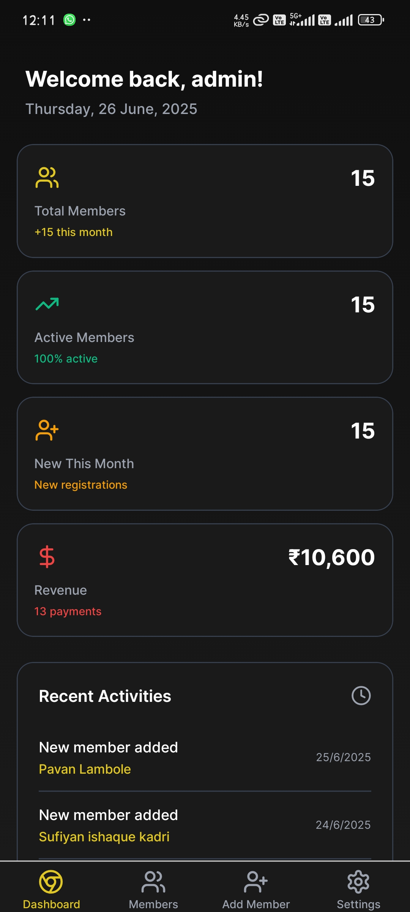

# Haji Fitness Point v1.0.0 Release

## 🎉 Initial Release Highlights

Welcome to the first release of Haji Fitness Point, your comprehensive gym management solution!

### 📱 Key Features

- **Member Management**
  - Add new members with detailed profiles
  - Edit member information
  - View member history and status
  - Quick member search and filtering

- **Payment Tracking**
  - Record and manage membership payments
  - Payment history visualization
  - Due payment notifications
  - Multiple payment mode support

- **Dashboard & Analytics**
  - Active members overview
  - Payment statistics
  - Membership expiry tracking
  - Daily/monthly revenue insights

### 📸 App Screenshots

#### Home Screen & Dashboard

*Main dashboard showing member statistics and quick actions*

#### Member Management

*Members list with search and filter options*


*Add new member interface with form validation*

#### Payment Interface

*Payment recording and tracking interface*

### 🚀 Installation & Setup

1. Clone the repository:
```bash
git clone https://github.com/PawanLambole/haji-fitness-point.git
```

2. Install dependencies:
```bash
cd haji-fitness-point
npm install
```

3. Start the development server:
```bash
npm run dev
```

### 📱 Mobile App Build

For Android:
```bash
npm run android
```

For iOS:
```bash
npm run ios
```

### 🛠 Technical Details

- **Framework**: React Native with Expo
- **Database**: Supabase
- **UI Components**: Custom components with Expo elements
- **State Management**: React Context API
- **Authentication**: Supabase Auth

### 📦 Dependencies

Key packages and versions:
- React Native: 0.79.3
- Expo: 53.0.0
- Supabase: 2.39.0
- React Navigation: 7.0.14

### 🔄 Migration Notes

First release - no migrations required.

### 🐛 Known Issues

- None reported in this initial release

### 🔜 Upcoming Features

1. WhatsApp integration for notifications
2. Advanced reporting features
3. Membership plan management
4. Attendance tracking
5. Staff management module

### 📝 Contributing

We welcome contributions! Please check our contributing guidelines in the repository.

### 🤝 Support

For support and queries:
- Create an issue in the GitHub repository
- Contact the development team

### 📄 License

MIT License - See LICENSE file for details

---

**Note**: This is the initial release of Haji Fitness Point. Your feedback and suggestions are valuable to us!